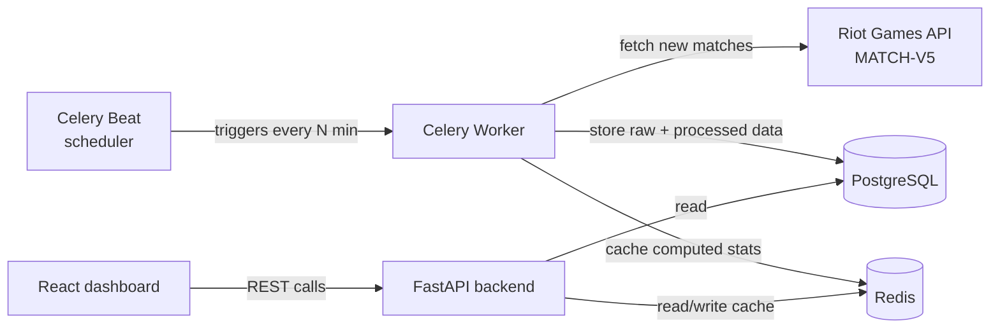

# LoL Performance Tracker

A personal analytics tool for League of Legends solo queue performance, built on real match data pulled directly from Riot Games' API.

## Why this project

In-client stats and sites like OP.GG only show generic aggregates. This project answers more specific, personal questions:

- Does my winrate actually drop after a losing streak, or does it just feel that way?
- Which champions and roles are genuinely carrying my rank right now, not just "feel" strong?
- Does session length or time of day actually affect how I perform?

## Features

- Automatic background sync of new ranked matches — no manual refresh, a scheduled worker pulls new games on its own
- Per-champion and per-role winrate breakdown
- Rolling-window stats (moving average winrate over the last 20 games)
- Session-based analysis (performance by time of day, session length)
- Interactive dashboard with charts

## Architecture



A scheduled worker (Celery, triggered by Celery Beat) periodically pulls new ranked matches from the Riot API and writes them to PostgreSQL. Redis serves as both the Celery broker and a cache layer for expensive aggregate queries. FastAPI exposes REST endpoints on top of that data, and a React dashboard renders it as charts.

## Tech stack

| Layer | Technology |
|---|---|
| Backend | FastAPI (Python 3.12) |
| Database | PostgreSQL |
| Task queue / scheduling | Celery + Redis |
| Frontend | React, Recharts |
| Containerization | Docker, docker-compose |
| Infrastructure as Code | Terraform |
| Cloud | AWS (RDS, ECS, S3, CloudWatch) |
| CI/CD | GitHub Actions |
| Data source | Riot Games API (MATCH-V5) |

## Project structure

```
lol-performance-tracker/
├── backend/
│   ├── app/
│   │   ├── api/            # FastAPI routes
│   │   ├── models/         # SQLAlchemy models
│   │   ├── services/       # Riot API client, stats calculations
│   │   └── main.py
│   ├── worker/
│   │   ├── tasks.py        # Celery tasks (match sync)
│   │   └── celery_app.py
│   └── requirements.txt
├── frontend/
│   ├── src/
│   │   ├── components/
│   │   └── pages/
│   └── package.json
├── infra/
│   └── terraform/           # AWS resources (RDS, ECS, S3, CloudWatch)
├── docker-compose.yml
└── README.md
```

## Getting started (local development)

1. Clone the repo and copy `.env.example` to `.env`.
2. Add your Riot API key to `.env` (`RIOT_API_KEY=...`), get one from the [Riot Developer Portal](https://developer.riotgames.com/).
3. Run everything with Docker Compose:
   ```bash
   docker-compose up --build
   ```
4. Backend available at `http://localhost:8000`, frontend at `http://localhost:3000`.

## Known limitations

- Riot's free development API key expires every 24 hours and has to be refreshed manually from the developer portal. A production key removes this limit but requires an approved application.
- Currently scoped to a single summoner/account (personal tool, not multi-user).

## Project status

🚧 In active development.

- [ ] Riot API client + match ingestion
- [ ] Database schema and models
- [ ] Celery worker + scheduled sync
- [ ] FastAPI endpoints
- [ ] React dashboard
- [ ] Dockerized local setup
- [ ] Terraform AWS deployment
- [ ] CI/CD pipeline

## License

MIT
